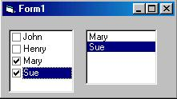

<div align="center">

## A\-1 ListBox \(style =1\) select


</div>

### Description

For Beginners. Copy the contents of ListBox1 to ListBox2 where the contents of ListBox1 is checked off. Remove any duplicates from ListBox2 and remove contents of ListBox2 where the contents of ListBox1 becomes unselected. (uhmmm... hope that made sense)
 
### More Info
 


<span>             |<span>
---                |---
**Submitted On**   |
**By**             |[twentyleafclover](https://github.com/Planet-Source-Code/PSCIndex/blob/master/ByAuthor/twentyleafclover.md)
**Level**          |Intermediate
**User Rating**    |4.8 (24 globes from 5 users)
**Compatibility**  |VB 6\.0
**Category**       |[Miscellaneous](https://github.com/Planet-Source-Code/PSCIndex/blob/master/ByCategory/miscellaneous__1-1.md)
**World**          |[Visual Basic](https://github.com/Planet-Source-Code/PSCIndex/blob/master/ByWorld/visual-basic.md)
**Archive File**   |[](https://github.com/Planet-Source-Code/twentyleafclover-a-1-listbox-style-1-select__1-25407/archive/master.zip)


### Source Code

```
Private Sub List1_Click()
Dim X As Long
Dim y As Long
Dim j As Long
j = 0
' Add selected items to ListBox2
 For X = 0 To List1.ListCount - 1
 If List1.Selected(X) = True Then
  List2.AddItem List1.List(X)
 End If
 Next
 ' Get rid of the now unselected items
 Dim i As Long
 For y = 0 To List1.ListCount - 1
 For i = 0 To List1.ListCount - 1
 List2.Text = List2.List(i)
 If List2.List(i) = List1.List(y) And List1.Selected(y) = False Then
  List2.RemoveItem i
 End If
 Next i
 Next
'Get rid of any duplicates in ListBox2
Do While j < List2.ListCount
 List2.Text = List2.List(j)
 If List2.ListIndex <> j Then
  List2.RemoveItem j
 Else
  j = j + 1
 End If
Loop
End Sub
```

